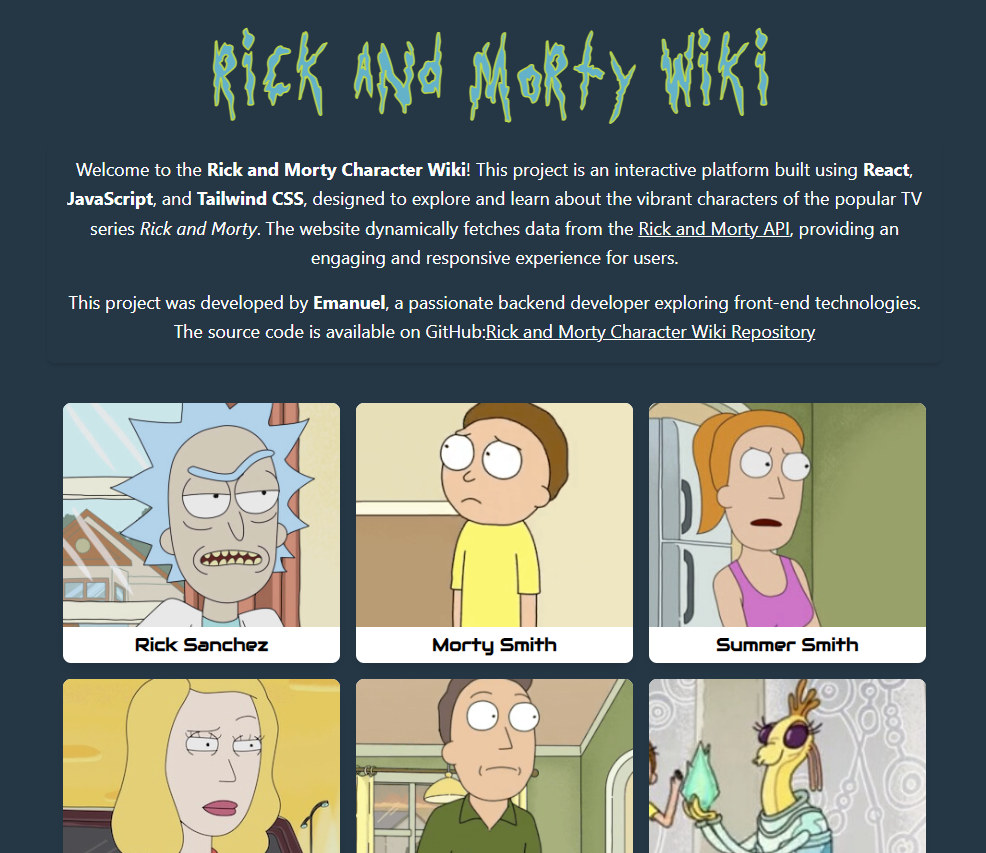

# Rick and Morty API Wiki Project

## About the Project
This project is a dynamic character Wiki developed using **React** and **JavaScript**. It consumes data from an API to display a list of characters from a TV series, allowing users to explore detailed information about each character from Rick and Morty.

## Features
- Dynamic listing of characters.
- Search for characters.
- Detailed view of individual character information.
- User-friendly navigation between pages.

## Live Demo
Access the live version of the app here: [Wiki Rick and Morty](https://wiki-rick-n-morty-app.vercel.app)



## Technologies Used
- **Frontend**: React
- **Language**: JavaScript
- **State Management**: React Hooks (useState, useEffect)
- **Styling**: TailwindCSS
- **HTTP Requests**: Axios

## Installation and Setup
Follow the steps below to set up the project in your local environment:

### 1. Clone the Repository
```bash
git clone https://github.com/emanuelconte/wiki-Rick-n-Morty.git
cd wiki-Rick-n-Morty

### 2. Install Dependencies
Make sure Node.js is installed. Then, run:
```bash
npm install
```

### 3. Run the Project
Start the development server with the command:
```bash
npm start
```
The app will open at [http://localhost:3000](http://localhost:3000).

## How to Contribute
1. Fork the repository.
2. Create a branch for your feature (
`git checkout -b feature/your-feature-name`).
3. Implement your feature and commit the changes.
4. Submit a pull request for review.

## License
This project is licensed under the MIT License. See the `LICENSE` file for more details.

## Contact
For questions or suggestions, reach out:
- **Name**: Emanuel
- **Email**: [emanuelcontecardoso@gmail.com](mailto:emanuelcontecardoso@gmail.com)
- **GitHub**: [emanuelconte](https://github.com/emanuelconte)

